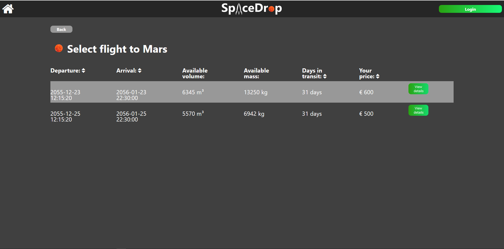

# Mars web project group 03

## What can a user or admin do in the aplha version
* Users:
  * A user can create a new account
  * A user can login to his account
  * A user can see his account info
  * A user can see his orders
  * A user can see what flights are available (ordering not yet impemented)
* Admins:
  * An admin can login to his account
  * An admin can see an overview of all flights
  * An admin can see an details page of the flights with all the placed orders

## Flow
* Home page:
  * When a user visits our webclient he gets greeted with the home page. On this page there are two large buttons with the planets, if he clicks on these he gets redirected to the flights page. On the right top of the screen there is a login button (changes to account or admin button when logged in, not yet impemented) if he clicks on it you get redirected to the login page.
    
* Login page:
  * On this page the user can fill in his email and password. If this is correct he gets redirected to the userinfo page, if not an pop up shows up. A user can also go to the register by clicking on the register button or login in with google(not yet impemented).
    
* Register page:
  * On this page the user can fill in his info and click on the register button to register and gets redirected to the login page.
  
* Flights page:
  * On this page the user can see a list of all future flights of the previously clicked planet. When he clicks on view more a dropdown appears with inputs fields for the order details. When the user clicks on the order button he gets redirected to the payment page(not yet impemented).
    
* Userinfo page:
  * On this page the user can see an table with his user info with two buttons to edit his info or password(not yet impemented). The home button in the right corner has changed into a logout button. On the leftside there is a sidenav with a button to redirect to the userorders page
  * IMPORTANT: if you want to go userinfo pages you need to do this via the url: go to page userInfo.html

* Userorder page:
  * On this page the user can see an overview of all his orders, when he clicks on the view more button he gets redirected to the Userordertracking page.
  * IMPORTANT: if you want to go userinfo pages you need to do this via the url: go to page userOrders.html

* Userordertracking page:
  * On this page the user can see all the details about his order such as an visual presentation of the progression of his order.
  * IMPORTANT: if you want to go userinfo pages you need to do this via the url: go to page userOrderTracking.html

* Adminhome page:
  * On this page the admin can see an overview of all flights, when he clicks on the more info page he gets redirected to the adminflightdetails page. When he clicks on view more next to the planet title, Only the flights to that planet get displayed. On the left side there is a sidenav with a button to the statistics(not yet impemented).
  * IMPORTANT: if you want to go admin pages you need to do this via the url: go to page adminFlightsOverview.html or adminFlightsOverviewPlanet.html

* adminflightdetails page:
  * On this page the admin can see an table with all the flight details, underneat this there is an overview of all orders placed on this flight.
  * IMPORTANT: if you want to go admin pages you need to do this via the url: go to page adminFlightDetails.html
  