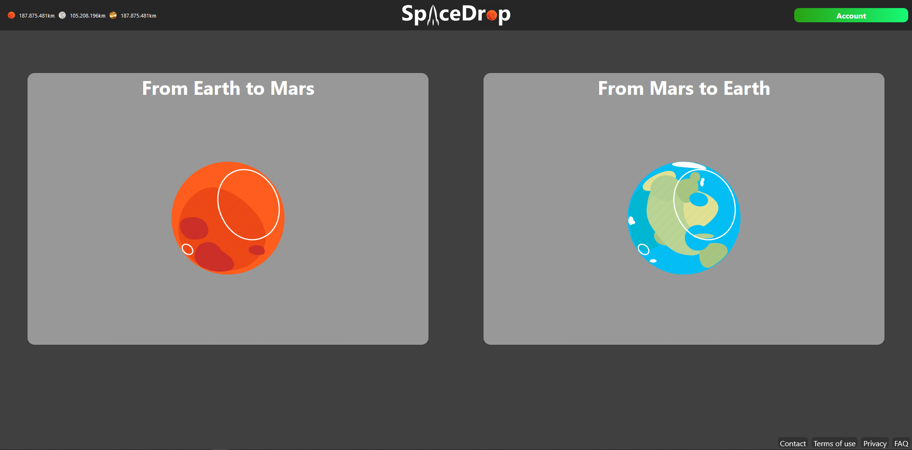
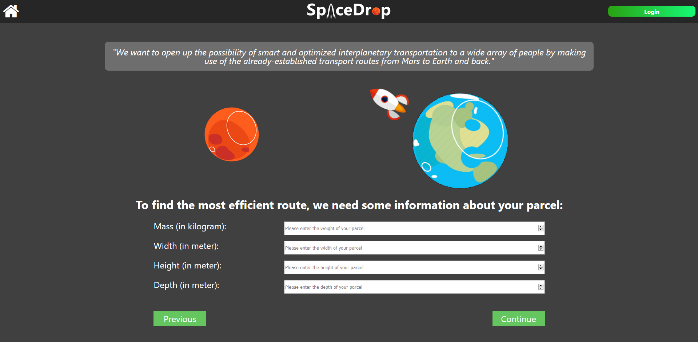
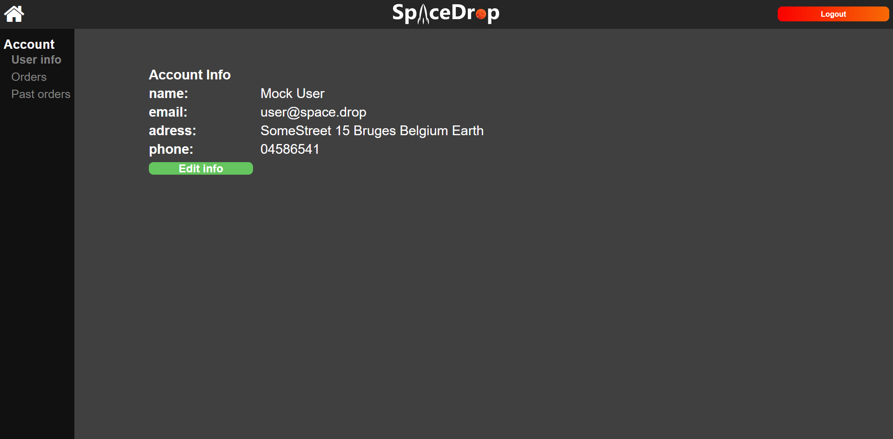

# Mars web project group 03

## What can a user or admin do in the finalise all version
* Users:
  * A user can create a new account
  * A user can login to his account
  * A user can login with oAuth (google)
  * A user can see his account info
  * A user can edit his account info
  * A user can see his orders
  * A user can track his orders
  * A user can search to the flights with the route optimizer
  * A user can reserve space on a flight
* Admins:
  * An admin can login to his account
  * An admin can see an overview of all flights
  * An admin can see an details page of the flights with all the placed orders

## Flow
* Home page:
  * When a user visits our webclient he gets greeted with the home page. On this page there are two large buttons with the planets, if he clicks on these he gets redirected to the routeOptimizer page. On the right top of the screen there is a login button (changes to account button when logged in) if he clicks on it you get redirected to the login page or user info page.

* Login page:
  * On this page the user can fill in his email and password. If this is correct he gets redirected to the userinfo page, if not an pop up shows up.
  * A user can create an account by clicking on the register button
  * The user can also login with oAuth (its not possible to place orders with a google account)
  * You can also opt to login as a mock user, this is to make it easier for the teachers to test our application.

* Register page:
  * On this page the user can fill in his info and click on the register button to register and gets redirected to the login page.

* RouteOptimizer page:
  * On this page the user can fill in his details about the parcel.

* RouteOptimizer page 2:
  * On this page the user can fill the address of the parcel.
  * With the slider the user can choose how fast his parcel needs to be shipped, when the slider is moved the user gets an estimate of the price and arrival date. 

* Flights page:
  * On this page the user can see a list of all flights fitted to what he filled in in the flight optimize
  * When the user clicks on view more an popup opens up with some more information about the rocket with a 3d rendering of the rocket.

* Payment page:
  * On this page the user gets an overview of the order details and can choose his payment method.
  * When he clicks on his payment method he get a popup where he needs to fill in his details.

* OrderConfirmation page:
  * On this page the user gets an overview of the order details and a qr code
  * when the qr code is scanned a webpage opens up with tracking information and status.

* Userinfo page:
  * On this page the user can see an overview of his user details
  * If the user clicks on the edit account button he gets redirected to the editUserInfoPage

* EditUserinfo page:
  * On this page the user can fill in this new user details

* Userorder page:
  * On this page the user can see an overview of all his future orders, when he clicks on the view more button he gets redirected to the Userordertracking page.

* PastUserorder page:
  * On this page the user can see an overview of all his past orders, when he clicks on the view more button he gets redirected to the Userordertracking page.

* Userordertracking page:
  * On this page the user can see all the details about his order such as an visual presentation of the progression of his order.

* Adminhome page:
  * On this page the admin can see an overview of the next future flights, when he clicks on the more info page he gets redirected to the adminflightdetails page. When he clicks on view more next to the planet title, Only all the flights to that planet get displayed. On the left side there is a sidenav with a button to the statistics(not impemented).

* adminflightdetails page:
  * On this page the admin can see an table with all the flight details, underneath this there is an overview of all orders placed on this flight.
  
  
## Known bugs
 * 500 internal server error when logging in as a user
   * This is to check if the user is a admin or not
    * We excecute a api call that only an admin can do,if it returns an error the user isn't an admin
    * This was a last day fix
